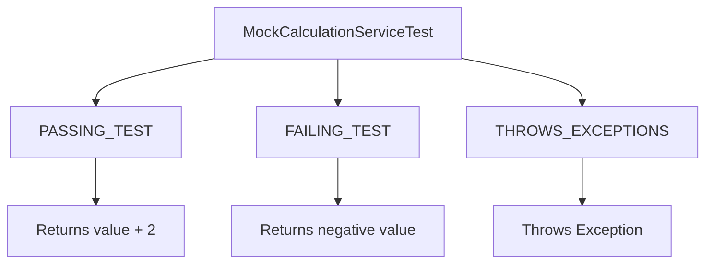

# Chameleon Testing with Schizophrenic Behaviour
**We are not walking like an Egyptian, we are Mocking like a Chameleon**

## Chameleon Testing Philosophy

In order to achieve better test coverage, we perform both positive and negative tests using a Mock (Stub) class. This class is designed to exhibit almost schizophrenic behaviour, which can be controlled via an enumerated parameter passed at instantiation.  

The philosophy behind this approach is to simulate multiple internal states of a service without changing production code. By configuring the mock, tests can mimic:

- **Successful behaviour** – producing expected, valid outputs.  
- **Failure behaviour** – producing invalid or negative outputs to simulate a malfunction.  
- **Exceptional behaviour** – throwing errors to verify how the system responds to unexpected conditions.  

This enables comprehensive testing of error handling, edge cases, and service resilience in a controlled and repeatable manner.

---

## Project Structure

```mermaid
graph TD
    A[com.chameleon.testing] --> B[resource]
    A --> C[service]
    A --> D[service.impl]
    A --> E[enums]
    A --> F[mocking]

    B --> B1[CalculationResource]
    C --> C1[CalculationService]
    D --> D1[CalculationServiceImpl]
    E --> E1[CamelionTestBehavior]
    F --> F1[MockCalculationService]
````

* **com.chameleon.testing.resource**

    * `CalculationResource` – exposes REST endpoint `/calculate/addTwoTo/{value}`.
* **com.chameleon.testing.service**

    * `CalculationService` – interface for calculation logic.
* **com.chameleon.testing.service.impl**

    * `CalculationServiceImpl` – production implementation of the calculation service.
* **com.chameleon.testing.enums**

    * `CamelionTestBehavior` – enumerated values defining three test behaviours:

        * `PASSING_TEST` – produces valid positive outputs.
        * `FAILING_TEST` – produces negative outputs to simulate a service failure.
        * `THROWS_EXCEPTIONS` – throws exceptions to simulate unexpected errors.
* **com.chameleon.testing.mocking**

    * `MockCalculationService` – mock implementation of `CalculationService` for testing.

        * Can be configured to behave in one of the predefined ways.
        * Provides a flexible mechanism for simulating various service states.

---

## REST Flow

```mermaid
sequenceDiagram
    participant Client
    participant Resource as CalculationResource
    participant Service as CalculationServiceImpl
    participant Mock as MockCalculationService

    Client->>Resource: GET /calculate/addTwoTo/{value}
    alt Production Service
        Resource->>Service: addTwoTo(value)
        Service-->>Resource: value + 2
        Resource-->>Client: 200 OK with result
    else Mocking PASSING_TEST
        Resource->>Mock: addTwoTo(value)
        Mock-->>Resource: value + 2
        Resource-->>Client: 200 OK with result
    else Mocking FAILING_TEST
        Resource->>Mock: addTwoTo(value)
        Mock-->>Resource: negative value
        Resource-->>Client: 401 CalculationService down
    else Mocking THROWS_EXCEPTIONS
        Resource->>Mock: addTwoTo(value)
        Mock-->>Resource: throws Exception
        Resource-->>Client: 500 CalculationService failed
    end
```

---

## Unit Tests



* `MockCalculationServiceTest` – verifies the behaviour of the mock service for all three enumerated states:

    * **PASSING_TEST** – ensures expected positive results.
    * **FAILING_TEST** – ensures negative results simulate a malfunction.
    * **THROWS_EXCEPTIONS** – ensures the system correctly handles unexpected errors.

---

## Behaviour

By switching between different states in the mock service, we can explore how the microservice reacts to:

* Successful operations (positive results)
* Service failures (negative results)
* Exceptional conditions (errors)

This approach allows thorough testing of error handling and service resilience without modifying production code.

---

## Running the application in dev mode

You can run your application in development mode, which enables live coding, using:

```shell
./mvnw quarkus:dev
```

Then access the REST endpoint:

```
GET http://localhost:8080/calculate/addTwoTo/5
```

The service will return either the calculated result or an appropriate error message depending on the behaviour simulated.


---
