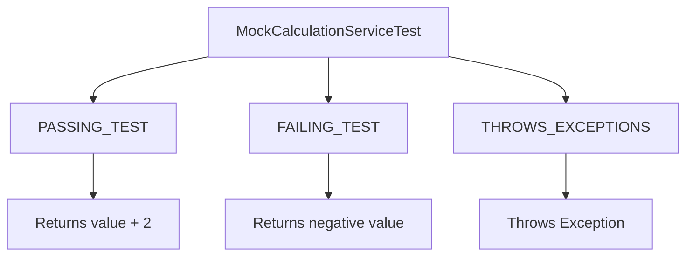

# Mock Test like a Chameleon ( Better TDD with Schizophrenic Behaviour)
**We are not walking like an Egyptian, we are Mocking like a Chameleon**

## Problem Statement
1. **Using Mockito** to write unit tests as an afterthought **produces brittle unit tests**.
2. We wanted to **implement Mocking using proper Mock classes**.
3. **Not every Java developer likes Mockito**, this is for them
4. **This uses Real Mocking**.
5. **Mocking is only carried out inside the unit test package**

## Chameleon Testing Philosophy
1. To achieve better test coverage, we perform both positive and negative tests using a Mock (Stub) class. 
2. This class is designed to exhibit almost schizophrenic behaviour, which can be controlled via an enumerated parameter passed at instantiation.  
3. The philosophy behind this approach is to simulate multiple internal states of a service without changing production code. By configuring the mock, tests can mimic:

### The CamelionTestBehavior enum
We start with an enum: **CamelionTestBehavior**, which controls the behaviour of the Mock class, giving us these Behaviours:
- **Successful behaviour** – producing expected, valid outputs.  
- **Failure behaviour** – producing invalid or negative outputs to simulate a malfunction.  
- **Exceptional behaviour** – throwing errors to verify how the system responds to unexpected conditions.  

This enum will have this code:
```java
public enum CamelionTestBehavior {
  PASSING_TEST,       // Mock class returns valid values
  FAILING_TEST,       // Mock class returns invalid values
  THROWS_EXCEPTIONS   // Mock class throws exceptions
}
```
**This enum is in the unit test package**

### The Mock Class:
1. **We make the default constructor private**.
2. **We pass the CamelionTestBehavior enum as a parameter of the overridden constructor**.
3. **Our unit test instantiates the class using the overridden constructor with different enum values, allowing us to control the test behaviour**.

This enables comprehensive testing of error handling, edge cases, and service resilience in a controlled and repeatable manner.

An example of a Mock Class
```java

public class MockCalculationService implements CalculationService {

  private final CamelionTestBehavior behaviour;

  // Private default constructor
  private MockCalculationService() {}

  // Public constructor with behaviour parameter
  public MockCalculationService(CamelionTestBehavior behaviour) {
    this.behaviour = behaviour;
  }

  @Override
  public int addTwoTo(int value) throws Exception {
    switch (behaviour) {
      case PASSING_TEST:
        return value + 2;
      case FAILING_TEST:
        return -1 * Math.abs(value + 2);
      case THROWS_EXCEPTIONS:
        throw new Exception("Simulated exception for testing");
      default:
        return value;
    }
  }
}
```

**This class is in the unit test package: mocking**

---

### The Unit test that uses the Mock class
An example of a Unit test that uses a Mock Class
```java

class MockCalculationServiceTest {

  @Test
  void testPassingTestBehaviour() throws Exception {
    MockCalculationService service = new MockCalculationService(CamelionTestBehavior.PASSING_TEST);
    int result = service.addTwoTo(3);
    assertEquals(5, result, "PASSING_TEST should return value + 2");
  }

  @Test
  void testFailingTestBehaviour() throws Exception {
    MockCalculationService service = new MockCalculationService(CamelionTestBehavior.FAILING_TEST);
    int result = service.addTwoTo(3);
    assertTrue(result < 0, "FAILING_TEST should return a negative value");
  }

  @Test
  void testThrowsExceptionsBehaviour() {
    MockCalculationService service = new MockCalculationService(CamelionTestBehavior.THROWS_EXCEPTIONS);
    assertThrows(Exception.class, () -> service.addTwoTo(3),
        "THROWS_EXCEPTIONS should throw an Exception");
  }
}
```

**This class is in the unit test package: mocking**

---

## Example Project Structure

```mermaid
graph TD
    A[com.chameleon.testing] --> B[resource]
    A --> C[service]
    A --> D[service.impl]
    A --> E[enums]
    A --> F[mocking]

    B --> B1[CalculationResource]
    C --> C1[CalculationService]
    D --> D1[CalculationServiceImpl]
    E --> E1[CamelionTestBehavior]
    F --> F1[MockCalculationService]
````

* **com.chameleon.testing.resource**

    * `CalculationResource` – exposes REST endpoint `/calculate/addTwoTo/{value}`.
* **com.chameleon.testing.service**

    * `CalculationService` – interface for calculation logic.
* **com.chameleon.testing.service.impl**

    * `CalculationServiceImpl` – production implementation of the calculation service.
* **com.chameleon.testing.enums**

    * `CamelionTestBehavior` – enumerated values defining three test behaviours:

        * `PASSING_TEST` – produces valid positive outputs.
        * `FAILING_TEST` – produces negative outputs to simulate a service failure.
        * `THROWS_EXCEPTIONS` – throws exceptions to simulate unexpected errors.
* **com.chameleon.testing.mocking**

    * `MockCalculationService` – mock implementation of `CalculationService` for testing.

        * Can be configured to behave in one of the predefined ways.
        * Provides a flexible mechanism for simulating various service states.

---

## Example Project REST Flow

```mermaid
sequenceDiagram
    participant Client
    participant Resource as CalculationResource
    participant Service as CalculationServiceImpl
    participant Mock as MockCalculationService

    Client->>Resource: GET /calculate/addTwoTo/{value}
    alt Production Service
        Resource->>Service: addTwoTo(value)
        Service-->>Resource: value + 2
        Resource-->>Client: 200 OK with result
    else Mocking PASSING_TEST
        Resource->>Mock: addTwoTo(value)
        Mock-->>Resource: value + 2
        Resource-->>Client: 200 OK with result
    else Mocking FAILING_TEST
        Resource->>Mock: addTwoTo(value)
        Mock-->>Resource: negative value
        Resource-->>Client: 401 CalculationService down
    else Mocking THROWS_EXCEPTIONS
        Resource->>Mock: addTwoTo(value)
        Mock-->>Resource: throws Exception
        Resource-->>Client: 500 CalculationService failed
    end
```

---

## Example Project Unit Tests



* `MockCalculationServiceTest` – verifies the behaviour of the mock service for all three enumerated states:

    * **PASSING_TEST** – ensures expected positive results.
    * **FAILING_TEST** – ensures negative results simulate a malfunction.
    * **THROWS_EXCEPTIONS** – ensures the system correctly handles unexpected errors.

---

## Behaviour

By switching between different states in the mock service, we can explore how the microservice reacts to:

* Successful operations (positive results)
* Service failures (negative results)
* Exceptional conditions (errors)

This approach allows thorough testing of error handling and service resilience without modifying production code.

---

## Running the Example Project application in dev mode

You can run your application in development mode, which enables live coding, using:

```shell
./mvnw quarkus:dev
```

Then access the REST endpoint:

```
GET http://localhost:8080/calculate/addTwoTo/5
```

The service will return either the calculated result or an appropriate error message, depending on the behaviour simulated.


---
